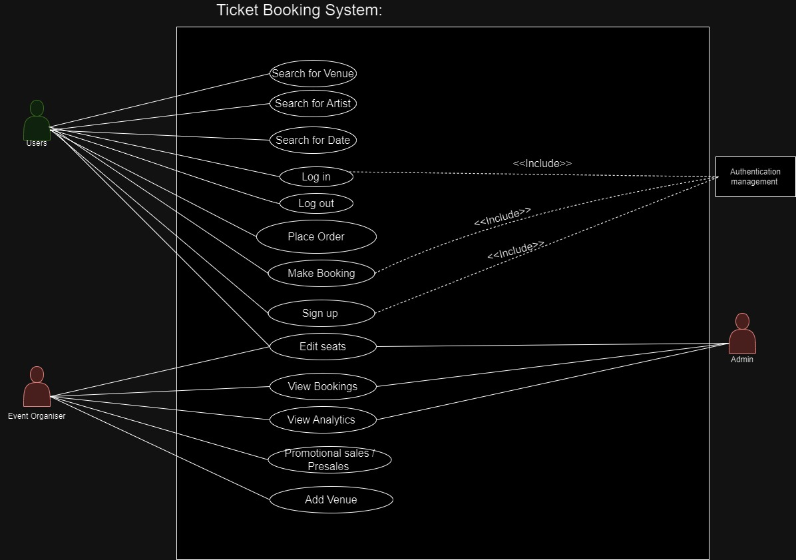

# M2: Project Description and Requirements
## DUE Feb 16, 11:59pm

### For this milestone, you need to submit a pdf report with the following details of your project:

- What your project is
- A high-level description of what your project will offer. The description needs to adequately detail a summary of what it will do, but you have a lot of freedom to decide what your final product will look like as long as you perform a realistic analysis of the problem.  
- Your user requirements (what will users be able to do with the system),
    - The users should be able to do what the use case diagram describes, we want a functional ticketing system, similar to Ticket master or other ticketing websites. We fully understand that our app may not look and work as well as Ticketmaster as we only have a certain amount of time and we are much more limited. However the user should be able to search on our website for up and coming venues and concerts that they may want to go to. our app should be able to faciliate the wants and needs of the user. as we should be able to create and app that allows users to purchase and sell tickets. the should be able to make and account and sign up with Ticket Tech and interact with the app such that they are able to buy tickest for concerts and venues that they wish to see.
- Your functional requirements (what will the system do to support users), and non-functional requirements. If you feel that other categories of requirements are needed, you can include them.  Recall that the requirements are used not only to determine the use cases that need to be developed but also to measure the success of the project (i.e., did you implement everything that was identified during the requirements engineering phase). Consider using proto-persona or journey lines to ensure you can properly and completely visualize how a user will interact with your project.  Don't forget that you will have different categories of users.  
- Your use case diagrams with the proper level of detail describing the specific scenarios.  You will need to include your diagram as well as detailed text    

    ###### Use Case 1 - Search for Venue
    - Primary actor: Users (purchasers)
    - Scope: Concert fans / sports fans
    - Level: User goal
    - Stakeholders and interests:
        - Purchaser - wants to browse venues and find one near them.
        - Admin - wants to observe who is browsing certain venues?
    - Precondition: User must access Ticket-Tech, search function must work.
    - Minimal Guarantee: Venue or group of venues is selected and allows user to see upcoming events at venue
    - Success Guarantee: Venue or group of venues is selected and events at venues are recommended to users. 
    - Main success scenario:
        - User wants to purchase a ticket for a certain event
        - User searches for a venue or an area
        - Ticket-Tech shows the venue or venues in the given areaUser gets access to venue and can see all upcoming events and dates at a certain venue
        - User can choose events they want to purchase tickets fo
    - Extensions:
        - 2a. Venue not found in location
	    - 2a1 display simple error message stating no results found
    ###### Use Case 2 - Search for artist:
    - Primary actor: Users (purchasers)
    - Scope: Concert fans / sports fans
    - Level: User goal
    - Stakeholders and interests:
        - Purchaser - wants to browse by artist and find the artist they want and all of their shows
        - Admin - can observe what artist are doing what shows 
    - Precondition: User must access Ticket-Tech, search function must work.
    - Minimal Guarantee: Artist selected and allows user to see upcoming events that artist is apart of 
    - Success Guarantee: artist or band is selected and events at venues are recommended to users.
    - Main success scenario:
        - User wants to purchase a ticket for a certain artist
        - User searches for an artist or a band
        - Ticket-Tech shows the venue or venues that the artist or band is a part of. in the given area User gets access to venue that the artist is at  and can see all upcoming events and dates at a certain artist/band
        - User can choose events they want to purchase tickets fo
    - Extensions:
        - 2a. Artist not found
        - 2a1 display simple error message stating no results found

    ###### Use Case 3 - Promotional / Sales / Presales
    - Primary actor: Admin
    - Scope: Ticket-Tech promotional department
    - Level: Admin goal
    - Stakeholders and interests:
        - Purchaser: who wants to buy the promotion deal on certain tickets 
    - Precondition: User already has an account in the platform
    - Minimal Guarantee: User is able to purchase tickets on sale.
    - Success Guarantee: User bought the ticket with a promotional deal, updates users
    transaction with discounted price they bought at 
    - Main success scenario:
        - User logs into the platform and 
        - Finds the promotional section on the top
        - Clicks into it
        - Sees what the tickets are on discount
        - They can also find certain tickets by searching function
        - Proceeds the to purchase with discounted price
        - Shows the updated discounted price on users transaction
    - Extensions:
        - 2a. Venue not found in location
	        - 2a1 display simple error message stating no results found
        - 3a. Tickets sold in between selection and checkout
	        - 3a1 display error message stating tickets are already sold
            # Not sure if this is enough, it was just copy paste from lab2 document

#### In reviewing your requirements, the reader should clearly understand what the team is proposing to build. 

 

In addition to the pdf, update your project README.md to include the requirements details and ensure that it is committed to your repo and pushed upstream by the end of the due date (I would suggest you create a Requirements Engineering branch). This will be reviewed and feedback provided to you on your commits.  

 

### Rubric:
- Description: 2 marks

- Requirements analysis and development: 5 marks

- Use case diagram and descriptions: 5 marks

#### Total: 12 